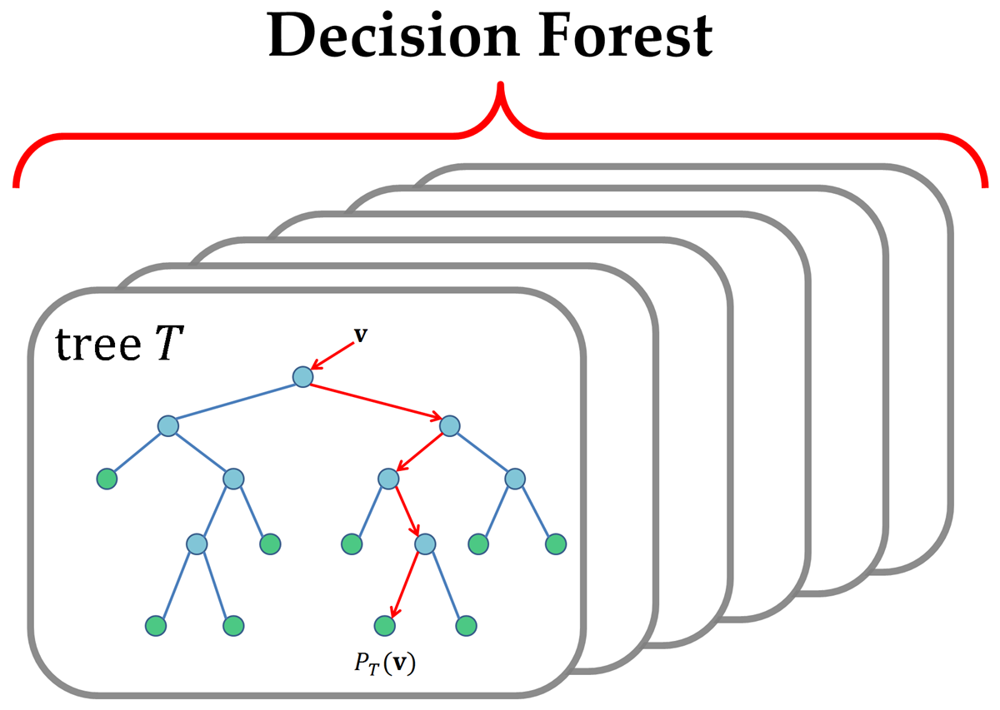

# Decision Tree and Decision Forest

[](https://www.mathworks.com/matlabcentral/fileexchange/39110-decision-tree-and-decision-forest)
[](https://github.com/wq2012/DecisionForest/actions/workflows/octave.yml)
[](https://github.com/wq2012/DecisionForest/actions/workflows/python.yml)
[](https://pypi.python.org/pypi/pydecisionforest)
[](https://pypi.org/project/pydecisionforest)
[](https://pepy.tech/project/pydecisionforest)

## Table of Contents
- [Overview](#overview)
- [Features](#features)
- [File Structure](#file-structure)
- [Usage](#usage)
  - [Prerequisites](#prerequisites)
  - [Compiling](#compiling)
  - [Training a Decision Tree](#training-a-decision-tree)
  - [Testing a Decision Tree](#testing-a-decision-tree)
  - [Training a Decision Forest](#training-a-decision-forest)
  - [Testing a Decision Forest](#testing-a-decision-forest)
  - [AdaBoost](#adaboost)
  - [Feature Importance](#feature-importance)
- [Tree File Format](#tree-file-format)
- [Python Package](#python-package)
  - [Design](#design)
  - [Installation](#installation)
  - [Usage](#usage-1)
- [Copyright and Citation](#copyright-and-citation)

## Overview

This package implements **Decision Tree** and **Decision Forest** (Random Forest) techniques in C++, optimized for efficiency. It provides a MEX interface to be easily called from **MATLAB** or **Octave**. Also, it provides a pure Python implementation for easy integration into other Python projects.

The algorithm is based on standard information gain principles and has been utilized in multiple research publications.



## Features

- **Efficient Implementation**: Core logic written in C++ for performance.
- **Easy Integration**: MEX wrappers allow direct usage in MATLAB/Octave.
- **Decision Tree**: Train and test single decision trees.
- **Decision Forest**: Train and test ensembles of trees (Random Forest) for improved robustness and accuracy.
- **Cross-Platform**: Tested on Windows, Mac OS, and Linux.

## File Structure

-   `code/`: C++ core implementation and MATLAB/Octave wrappers.
    -   `DecisionTree.h`, `HashTable.h`: Core data structures and algorithms.
    -   `TrainDecisionTree.cpp`, `RunDecisionTree.cpp`: MEX interfaces.
    -   `*.m`: MATLAB/Octave scripts.
-   `python/`: Pure Python implementation.
    -   `decision_forest/`: Python package source.
    -   `tests/`: Unit tests.
-   `setup.py`: Python packaging configuration.
-   `documentation`: Relevant papers, posters, and slides.

## Usage

### Prerequisites
- MATLAB or Octave installed.
- C++ compiler compatible with MEX (e.g., `gcc`, `clang`, or MSVC).

### Compiling
Before using the package, compile the C++ source files. Run the following commands in MATLAB/Octave:
```matlab
mex TrainDecisionTree.cpp
mex RunDecisionTree.cpp
```

### Training a Decision Tree
To train a single decision tree:
```matlab
% X: n x d training data (n instances, d dimensions)
% Y: n x 1 labels (1, 2, ..., M)
% treeFile: path to save the tree
% depth: maximum depth of the tree
% noc: number of candidates to split at each node

% W: (Optional) n x 1 weights for each instance. Default is uniform.
% importance: (Optional) d x 1 vector of feature importance.

importance = TrainDecisionTree(X, Y, treeFile, depth, noc, W);
```

### Testing a Decision Tree
To test a single decision tree:
```matlab
% X: n x d testing data
% treeFile: path to the saved tree
% Y_pred: predicted labels
% P: probabilities

[Y_pred, P] = RunDecisionTree(X, treeFile);
```

### Training a Decision Forest
To train a decision forest (ensemble of trees):
```matlab
% forestPath: directory to save the forest
% forestSize: number of trees in the forest

TrainDecisionForest(X, Y, forestPath, forestSize, depth, noc);
```

### Testing a Decision Forest
To test a decision forest:
```matlab
% forestPath: directory where the forest is saved

[Y_pred, P] = RunDecisionForest(X, forestPath);
```

### AdaBoost

**AdaBoost** (Adaptive Boosting) is an ensemble learning method that can be used in conjunction with many other types of learning algorithms to improve performance. The output of the other learning algorithms ('weak learners') is combined into a weighted sum that represents the final output of the boosted classifier.

In this library, we implement **Multi-class AdaBoost (SAMME)**, where the weak learner is a **Decision Tree**.

#### Relationship with Decision Trees and Forests
-   **Decision Tree**: A single tree is trained on the data.
-   **Decision Forest (Random Forest)**: Multiple trees are trained independently on identifying subsets of data/features. They vote equally (or by averaging probabilities) for the final prediction.
-   **AdaBoost**: Trees are trained **sequentially**. After each tree is trained, the algorithm increases the weights of the misclassified instances. The next tree is then forced to focus on the hard-to-classify examples.
    -   Unlike Random Forest, where trees are independent, in AdaBoost, the training of the $(i+1)$-th tree depends on the $i$-th tree.
    -   Unlike Random Forest, where trees serve as equal voters, in AdaBoost, each tree is assigned a voting weight $\alpha$ based on its accuracy.

#### How It Works
1.  **Initialization**: All training instances are assigned equal weights $W = 1/N$.
2.  **Iterative Training**: For each iteration $m = 1 \dots M$:
    -   A **Decision Tree** is trained using the weighted data. The internal C++ core (`TrainDecisionTree`) has been updated to handle these instance weights, modifying the entropy calculation to account for the importance of each sample.
    -   The weighted error rate of the tree is calculated.
    -   A voting weight $\alpha_m$ is computed for the tree based on its error (lower error $\to$ higher $\alpha$).
    -   The instance weights $W$ are updated: weights of misclassified instances are increased.
3.  **Final Prediction**: The ensemble makes predictions by taking a weighted vote of the individual trees using their $\alpha$ values.

**Training**:
```matlab
% weights: Weights of weak classifiers (alpha)
% importance: Aggregated feature importance

[weights, importance] = TrainAdaBoost(X, Y, forestPath, forestSize, depth, noc);
```

**Testing**:
```matlab
[Y_pred, P] = RunAdaBoost(X, forestPath);
```

### Feature Importance
Both `TrainDecisionTree` and `TrainAdaBoost` return a feature importance vector. 
The importance of a feature is calculated based on the total entropy decrease (information gain) attributed to that feature during the training process.

## Tree File Format

> [!NOTE]
> This section describes the text-based file format used by the **C++/MATLAB** implementation. The Python implementation uses standard python objects and can be serialized using `pickle` or `joblib`.

The decision trees are saved as text files (e.g., `tree.txt`). Each file describes the structure and parameters of a trained tree.

### Header Line
The first line contains four numbers separated by tabs:
`depth` `d` `nol` `num_nodes`

- `depth`: Maximum depth of the tree.
- `d`: Dimensionality of the feature space.
- `nol`: Number of unique labels (classes).
- `num_nodes`: Total number of nodes in the saved tree.

### Node Lines
Each subsequent line represents a single node in the tree and contains tab-separated values. The format depends on whether the node is an internal node or a leaf node.

**Format**:
`node_index` `feature_index` `threshold` [`probabilities`]

- `node_index`: Integer index of the node.
    - Root node is index `0`.
    - For a node `n`, its left child is `2*n + 1` and right child is `2*n + 2`.
- `feature_index`: The feature dimension used for splitting (0-based index).
    - If `feature_index` is `-1`, the node is a **Leaf Node**.
    - If `feature_index` >= 0, the node is an **Internal Node** (Split Node).
- `threshold`: The threshold value for the split.
    - If feature value <= threshold, go to left child.
    - Otherwise, go to right child.
- `probabilities` (Leaf Nodes only): A sequence of `nol` floating-point numbers representing the unnormalized counts (or probabilities) for each class at this leaf.

**Example**:
```
5	4	3	7
0	2	1.500000	
1	0	0.800000	
2	-1	0.000000	10.000000	5.000000	2.000000	
3	-1	0.000000	20.000000	0.000000	1.000000	
4	-1	0.000000	8.000000	5.000000	0.000000	
...
```
*Explanation of example*:
- Header: depth 5, 4 dimensions, 3 classes, 7 nodes.
- Node 0: Splits on feature 2 with threshold 1.5.
- Node 2: Leaf node. Class counts are [10, 5, 2] for classes 1, 2, and 3 respectively.


## Python Package

We also provide a pure Python implementation of all algorithms.

### Design
The Python implementation is designed to be:
-   **Pure Python**: Easy to install and debug, with `numpy` as the only dependency.
-   **Vectorized**: Critical paths like entropy calculation are vectorized using NumPy to ensure reasonable performance.
-   **Consistent**: The API and logic mirror the C++/MATLAB implementation, ensuring consistent results across platforms.

### Installation
```bash
pip install pydecisionforest
```
Or install from source:
```bash
pip install .
```

### Usage
```python
from pydecisionforest import train_decision_forest, run_decision_forest, train_adaboost, run_adaboost

# Train Forest
forest = train_decision_forest(X_train, Y_train, forest_size=10, depth=5, noc=100)

# Save/Load Model
forest.save("model.pkl")
loaded_forest = forest.load("model.pkl")

# Predict
Y_pred = loaded_forest.predict(X_test)

# Train AdaBoost
weights, importance, model = train_adaboost(X_train, Y_train, forest_size=10, depth=5, noc=100)
model.save("adaboost.pkl")
Y_pred = model.predict(X_test)
```

The Python API offers a class-based interface (`DecisionTree`, `DecisionForest`, `AdaBoost`) with `fit`, `predict`, `save`, and `load` methods.

## Copyright and Citation

```
Copyright (C) 2013 Quan Wang <wangq10@rpi.edu>,
Signal Analysis and Machine Perception Laboratory,
Department of Electrical, Computer, and Systems Engineering,
Rensselaer Polytechnic Institute, Troy, NY 12180, USA
```

This software was developed as part of the following research. If you use this software in your research, please cite:

**Plain Text:**

> Quan Wang, Yan Ou, A. Agung Julius, Kim L. Boyer and Min Jun Kim.
> "Tracking Tetrahymena Pyriformis Cells using Decision Trees."
> 2012 21st International Conference on Pattern Recognition (ICPR),
> Pages 1843-1847, 11-15 Nov. 2012.

> Quan Wang, Dijia Wu, Le Lu, Meizhu Liu, Kim L. Boyer, and Shaohua Kevin Zhou.
> "Semantic Context Forests for Learning-Based Knee Cartilage Segmentation in 3D MR Images."
> MICCAI 2013: Workshop on Medical Computer Vision.

> Quan Wang.
> Exploiting Geometric and Spatial Constraints for Vision and Lighting Applications.
> Ph.D. dissertation, Rensselaer Polytechnic Institute, 2014.

**BibTeX:**

```bibtex
@inproceedings{wang2012tracking,
  title={Tracking tetrahymena pyriformis cells using decision trees},
  author={Wang, Quan and Ou, Yan and Julius, A Agung and Boyer, Kim L and Kim, Min Jun},
  booktitle={Proceedings of the 21st International Conference on Pattern Recognition (ICPR2012)},
  pages={1843--1847},
  year={2012},
  organization={IEEE}
}

@inproceedings{wang2013semantic,
  title={Semantic context forests for learning-based knee cartilage segmentation in 3D MR images},
  author={Wang, Quan and Wu, Dijia and Lu, Le and Liu, Meizhu and Boyer, Kim L and Zhou, Shaohua Kevin},
  booktitle={International MICCAI Workshop on Medical Computer Vision},
  pages={105--115},
  year={2013},
  organization={Springer}
}

@phdthesis{wang2014exploiting,
  title={Exploiting Geometric and Spatial Constraints for Vision and Lighting Applications},
  author={Quan Wang},
  year={2014},
  school={Rensselaer Polytechnic Institute},
}
```
